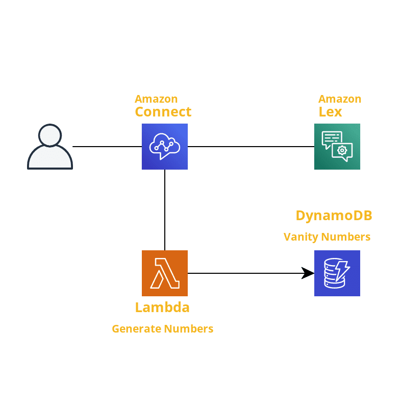
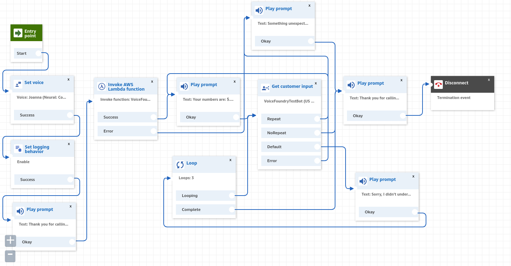

# Project: VanityNumberGenerator

## Overview

This app allows the users to call in and have several vanity numbers generated for their phone number. It uses Amazon Lex for voice commands, AWS Lambda to generate the numbers, DynamoDB to store the generated numbers, and an Amazon Connect contact center to integrate it all into a single flow.

## Architecture



### Contact Flow



## Implementation

### Lambda and DynamoDB

The [lambda](src/handlers/vanity-number-generator.js) created for this project is simple in concept.  Amazon Connect triggers the lambda with the user information.  The lambda takes the user's phone number and generates 5 vanity numbers from it.  Those 5 numbers are stored in DynamoDB and 3 of those numbers are returned to Amazon Connect.

I had originally intended to do the optional website task, so I created the DynamoDB table with a sort key containing the ISO date when the numbers are generated, but ultimately there wasn't enough time.

With the limited time I had available, I decided that the vanity numbers generated by the lambda weren't the most important thing to spend time on.  As a result, the lambda generates the vanity numbers by iterating over the last 7 digits of the customer's number and selecting a random letter from those available for that digit on the phone keypad.

The decision to do this directly led to an issue with the text-to-speech in connect. Since the vanity numbers are just random letters, it would sometimes say the letters and other times try to sound them out, so it was not understandable.  I got around this by adding spaces between each character in the vanity number which forced the text-to-speech to say each letter individually.

Ideally, with more time, a better algorithm for this could be developed to create vanity numbers with coherent words.

#### Deployment

This project makes use of the [AWS SAM CLI](https://aws.amazon.com/serverless/sam/) to deploy the serverless resources.  With the CLI installed, the lambda function and database can be created with the following commands. During the guided deploy, just make sure to grant the cli permission to create IAM roles when promted, as a role needs to be created for the lambda function to access DynamoDB.

```sh
$ sam build
$ sam deploy --guided
```

### Amazon Lex

The Lex bot is used as part of the Connect contact flow to determine whether the customer wants the text-to-speech to repeat the generated vanity numbers. It ended up being accurate enough when using the exact utterances defined on its intents, but it fails to classify anything else correctly. 

It was created as a custom bot with only two intents: NoRepeat and Repeat. The NoRepeat intent should be triggered by a negative answer, so it uses utterances like "no", "no thanks", "nope", etc.  Conversly, the Repeat intent is triggered by positive responses and uses utterances like "yes", "sure", "yeah", etc.

This could have been handled just as easily without Lex, but I simply wanted to try it out.  

### Amazon Connect Contact Flow

Although it appears that contact flows can be created by Cloud Formation, the process was not clear enough to do in the limited time available, so the contact flow was created manually.  It consists of ten nodes total and all Play Prompt nodes use the text-to-speech option.

1. **Set Voice** (Optional): sets the default voice to Joanna which was also used for the lex bot. The contact flow entry point connects to this node's input and the "Success" output connects to 2.
2. **Set Logging Behavior** (Optional): sets logging enabled for the contact flow. The "Success" output connects to 3.
3. **Play Prompt**: "Thank you for calling the vanity number generator. One moment while your numbers are generated."  The "Okay" output connects to 4.
4. **Invoke AWS Lambda function**: calls the lambda function deployed with the SAM CLI. The "Success" output connects to 5 and the "Error" output connects to 10.
5. **Play Prompt**: "Your numbers are: $.External.NumberOne, $.External.NumberTwo, and $.External.NumberThree."  The "Okay" output connects to 6
6. **Get Customer Input**: Prompts for input with text-to-speech "Would you like to hear your numbers again?" The lex bot is used to handle voice input with the two intents NoRepeat and Repeat configured.  The "Repeat" output connects to 5, the "NoRepeat" output connects to 7, the "Default" output connects to 8, and the "Error" output connects to 10.
7. **Play Prompt**: "Thank you for calling. Goodbye."  The "Okay" output disconnects the call.
8. **Play Prompt**: "Sorry, I didn't understand that"  The "Okay" output connects to 9.
9. **Loop**: loops 3 times if the user input from 6 wasn't understood.  The "Looping" output connects to 6.  The "Complete" output connects to 7.
10. **Play Prompt**: "Something unexpected occurred.  Sorry for the inconvenience."  The "Okay" output connects to 7.

## Possible Improvements

### Production

Some things I would ideally add before deploying to production:

* Better vanity number generation.  Nobody will use a service that generates random character strings as vanity numbers.
* Cloudwatch Alarms if the lambda is reaching an error state too often.
* Centralized logging.  As it is now, each service handles its own logging.  I'm not sure at this point if it's possible, but it would be nice to have distributed tracing like with Amazon XRay to track a call from beginning to end through all the various services.
* More robust error avoidance in the lambda.  Because this application is only available by phone, I made the assumption that the Connect event sent to Lambda would always have the customer number and would be a US number.  In production I would like to be sure that assumption is correct or handle the edge cases reliably.

### Wish List

Given more time to work on this, I would have liked to add:

* A better way to generate vanity numbers. Ideally I would have liked to find and integrate with an existing api for this since it seems like something which should already exist, but I couldn't find one in my brief search. 
* Cloudformation deployment for the Amazon Connect contact flows. It seems like this isn't officially supported yet and is handled by creating custom resources, but it would have been nice to get it working.
* An automated deployment pipeline using CodePipeline, CodeBuild, and CodeDeploy.
* The optional website portion of the assignment